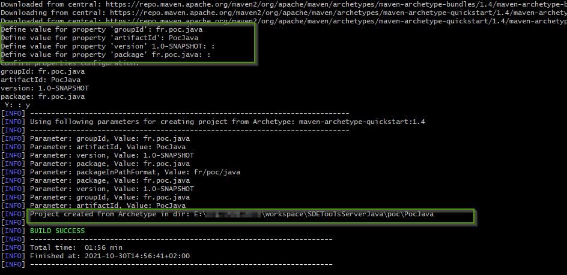

= Apache Maven
Doc Writer <christian.popescu@outlook.com>
v 1.1, 2021-10-30
:sectnums:
:toc:
:toclevels: 5

== Introduction

Apache Maven is a software project management and comprehension tool. 
Based on the concept of a project object model (*POM*), Maven can manage a project's build, reporting and documentation from a central piece of information.

https://maven.apache.org/[Apache Maven site] 

== Useful commands

List all the dependencies of one project.

	mvn dependency:tree
	

Install sources for the dependencies to be available for debugging.

	mvn dependency:sources
	
Modify POM file to download sources by default.

	<build>
			<plugins>
				<plugin>
					<groupId>org.apache.maven.plugins</groupId>
					<artifactId>maven-eclipse-plugin</artifactId>
					<configuration>
						<downloadSources>true</downloadSources>
						<downloadJavadocs>true</downloadJavadocs>
					</configuration>
				</plugin>
			</plugins>
	</build> 

Create Eclipse files for import (.classpath and .project)

    mvn eclipse:eclipse

== Create projects from maven archetype

=== Maven Quick Start Archetype

https://maven.apache.org/archetypes/maven-archetype-quickstart/[Maven Quick Start Archetype]

Create archetype command

    mvn archetype:generate -DarchetypeGroupId=org.apache.maven.archetypes -DarchetypeArtifactId=maven-archetype-quickstart -DarchetypeVersion=1.4

After that command 4 information are required and, after confirmation, the project is created.

== Create executable jars

=== Executable jars that includes dependencies

Use the maven-assembly-pluggin.
https://maven.apache.org/plugins/maven-assembly-plugin/index.html[Apache Maven-assembly-pluggin]

[source,xml]
----
        <plugin>
          <artifactId>maven-assembly-plugin</artifactId>
          <version>3.3.0</version>
          <executions>
            <execution>
              <phase>package</phase>
              <goals>
                <goal>single</goal>
              </goals>
            </execution>
          </executions>
          <configuration>
            <archive>
              <manifest>
                <mainClass>
                  fr.google.java.sandbox.App
                </mainClass>
              </manifest>
            </archive>
            <descriptorRefs>
              <descriptorRef>jar-with-dependencies</descriptorRef>
            </descriptorRefs>
          </configuration>
        </plugin>

----

To create package command line example:

    mvn clean package assembly:single

=== Ressources
https://www.baeldung.com/executable-jar-with-maven[Baeldung Executable Jar with Maven]

== Clean maven local repository

This command could be useful if error in build because of bad dependencies.

   mvn dependency:purge-local-repository

Example:

image::img/mvn-dependency-purge-local-repository-example
.png[]