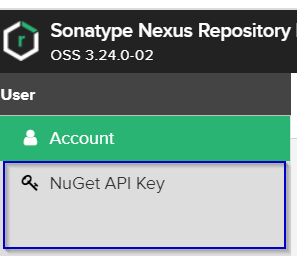

= Nexus
Doc Writer <christian.popescu@outlook.com>
v 1.0, 2020-06-24
:sectnums:
:toc:
:toclevels: 5

== Introduction
This article is about Nexus. It manages binaries and build artifacts across your software supply chain.

There are two versions

* Commercial - Nexus Repository Pro
* Free -  Nexus Repository OSS

== Nexus Repository OSS

The free artifact repository with universal format support.

https://www.sonatype.com/nexus-repository-oss?smtNoRedir=1[Official Site]

=== Installation

https://help.sonatype.com/repomanager3/installation/installation-methods[Installation Methods]

==== Windows

* Download package
* Unzip package to a choosen folder
    Example: F:\Applications\nexus-3.24.0-02-win64
* Tree structure

    Example:

    /f/Applications/nexus-3.24.0-02-win64
    $ tree -L 2
    .
    |-- nexus-3.24.0-02
    |   |-- NOTICE.txt
    |   |-- OSS-LICENSE.txt
    |   |-- PRO-LICENSE.txt
    |   |-- bin
    |   |-- deploy
    |   |-- etc
    |   |-- jre
    |   |-- lib
    |   |-- public
    |   `-- system
    `-- sonatype-work

* The Nexus Repository Manager executable nexus.exe can be found inside the bin directory

* It could be run with the following command. When run like this Nexus is started in shell window.

    nexus.exe /run

* The application can be accessed once the log shows the message "Started Sonatype Nexus". The running application can be stopped using CTRL+C at the appropriate console.

* The nexus.exe executable can be used to manage the repository manager as a service with the /start, /stop, /restart, /force-reload and /status commands.

=== Accessing the User Interface

* Once the repository manager is started, the application is listening on the configured IP address range and port. By default any IP address and port 8081 are used.

    URL http://<server_host>:<port> e.g. http://localhost:8081/

* The repository manager installation includes an administrative user with full access. Its username is [Blue]*admin* and the initial password can be found in an *admin.password* file in the *$data-dir* directory. You can sign in with the button on the top right corner of the user interface.

=== Deploying Packages to NuGet Hosted Repositories

In order to authenticate a client against a NuGet repository, NuGet uses an API key for deployment requests. The API key acts as an alias for the user account, so the same API key is used for all NuGet repositories within the repository manager. This user-specific key is generated separately by a user and can be regenerated at any time. At regeneration, all previous keys generated for that user are invalidated.

====  Accessing the Api Key

For usage with the repository manager, NuGet API keys are only needed when packages are going to be deployed.
Users with the necessary apikey-all security privilege can access the NuGet API Key feature view via the User menu by pressing on their username in the main toolbar.

Select button

Dialog is shown

Usage of the API key requires the NuGet API-Key Realm to be activated. To do this, simply add the realm to the active realms in the Realms feature of the Security menu from the Administration menu.

==== Setting the Api Key

Setting the Api Key for a given repository using nuget.exe tool example:

    nuget setapikey a1166690-be7f-31ba-8ce9-85aae086ac01 -source http://localhost:8081/repository/sandbox

==== Deploying the packages using nuget.exe tool

Example:

    nuget push DSALibrary.1.0.1.nupkg -source http://localhost:8081/repository/Sandbox_new/

