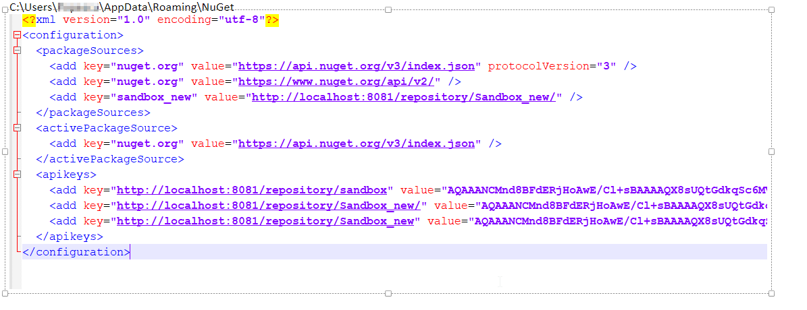

= NuGet

Doc Writer <christian.popescu@outlook.com>
v 1.0, 2020-06-24

= Introduction

NuGet is the package manager for .NET. The NuGet client tools provide the ability to produce and consume packages.

== Command line tools

* dotnet.exe CLI

The .NET Core CLI, dotnet.exe, works on all platforms (Windows, Mac, and Linux) and provides core NuGet features such as installing, restoring, and publishing packages. dotnet provides direct integration with .NET Core project files (such as .csproj), which is helpful in most scenarios. dotnet is also built directly for each platform and does not require you to install Mono.

* nuget.exe CLI

The nuget.exe CLI, nuget.exe, is the command-line utility for Windows that provides all NuGet capabilities.

== Package management

=== Configuration

User configuration file location and content example

=== Package information

* List packages for a given source

    nuget list -Source http://localhost:8081/repository/Sandbox_new

* Install package to a given project (packages folder)

    nuget install <packageID> -OutputDirectory packages

* Remove package