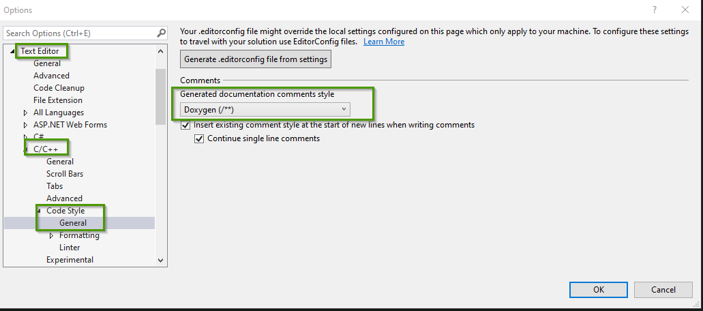
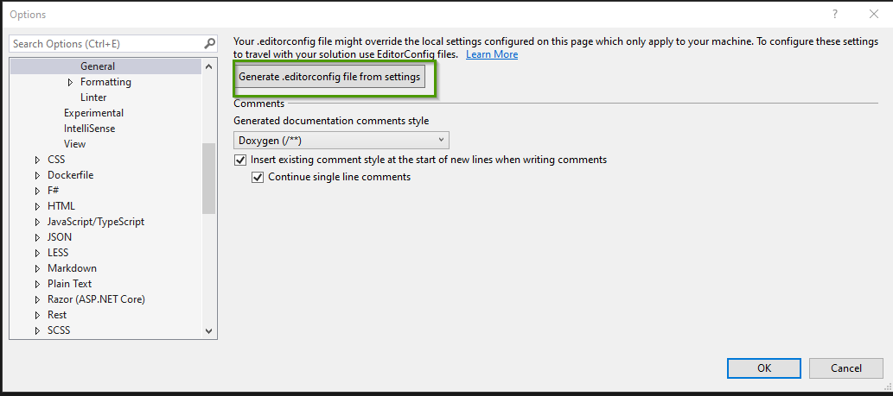

= Doxygen
Doc Writer <christian.popescu@outlook.com>
v 1.0, 2023-11-16
:sectnums:
:toc:
:toclevels: 5
:pdf-page-size: A3

== Introduction

As stated on the Doxygen's site :
Doxygen is the de facto standard tool for generating documentation from annotated C++ sources, but it also supports other popular programming languages such as C, Objective-C, C#, PHP, Java, Python, IDL (Corba, Microsoft, and UNO/OpenOffice flavors), Fortran, and to some extent D. Doxygen also supports the hardware description language VHDL.

https://www.doxygen.nl/index.html[Doxygen Home Page]

== Installation

For windows there are a standalone installation. It works without admin rights.

== Doxygen and Visual Studio

Setting Doxygen setting comments generation

Creating the config file

Info for configuration :
https://learn.microsoft.com/en-us/visualstudio/ide/cpp-editorconfig-properties?view=vs-2019[Infor for configuration on Microsoft site]