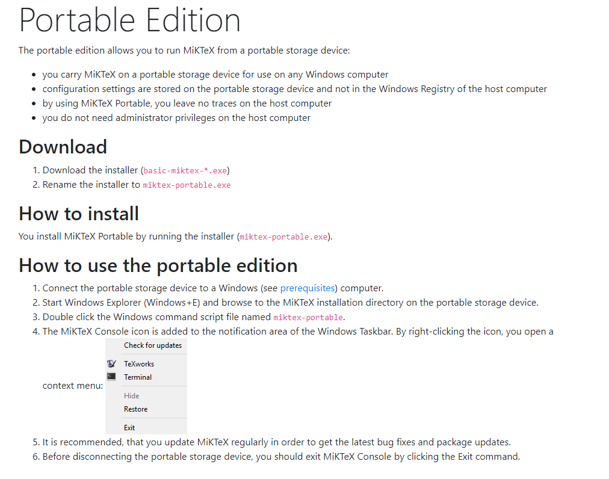
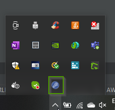
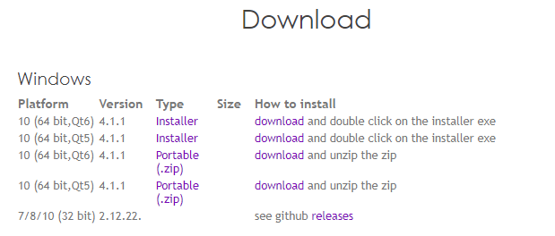

= Latex related
Doc Writer <christian.popescu@outlook.com>
v 1.0, 2021-11-22
:sectnums:
:toc:
:toclevels: 5

== MikTeX
MiKTeX is a modern TeX distribution for Windows, Linux and macOS.

https://miktex.org/[Official site]

Install portable version

After running script:

== TeXstudio

https://www.texstudio.org/[Official Site]

=== Configuration file