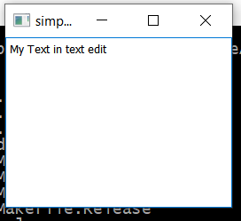

== Qt
Doc Writer <christian.popescu@outlook.com>
v 1.0, 2019-12-21
:toc:

*Qt* is a cross-platform application development framework for desktop, embedded and mobile.

With *Qt*, GUIs can be written directly in C++ using its *Widgets* module. Qt also comes with an interactive graphical tool called *Qt Designer* which functions as a code generator for Widgets based GUIs.
*Qt Designer* can be used stand-alone but is also integrated into Qt Creator.

[blue]_Qt is far more than a GUI toolkit_. It provides modules for cross-platform development in the areas of networking, databases, OpenGL, web technologies, sensors, communications protocols (Bluetooth, serial ports, NFC), XML and JSON processing, printing, PDF generation, and much more.

=== Create simple application without Qt Creator

1. Create project folder

	Example: 03-SimpleAppWithouQtCreator

2. Add the following main.cpp file

[source, c++, indent=4]
----
include::src/Main.cpp[]
----
 
3.Add Qt project file SimpleApp.pro

[source, indent=4]
----
include::src/SimpleApp.pro[]
----

4.In QT command window (MSVS or MingW) call *qmake* tool. The qmake generates the make files.

5.In QT command windows run the make/nmake command.

6.Run the *.exe file created in release/debug folder

