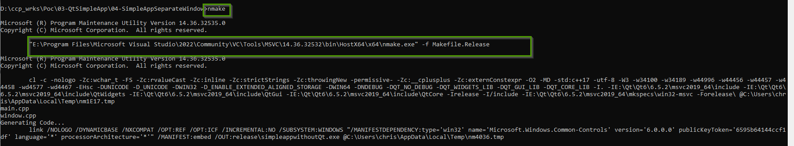
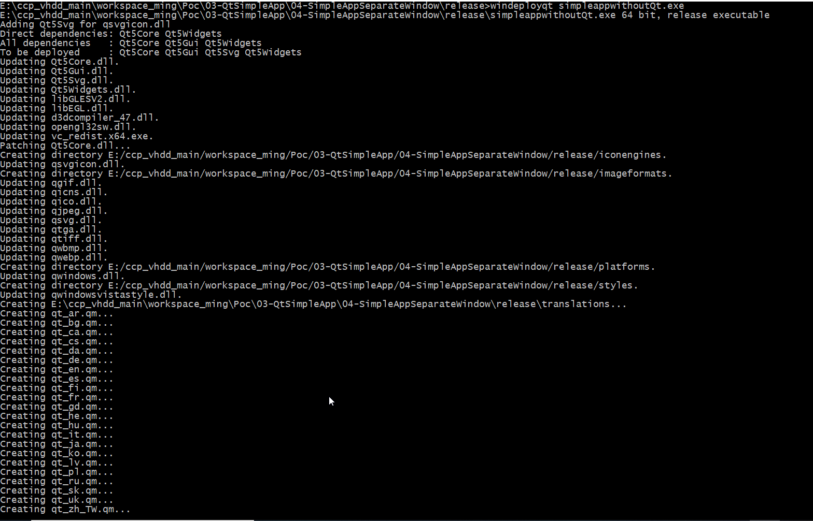
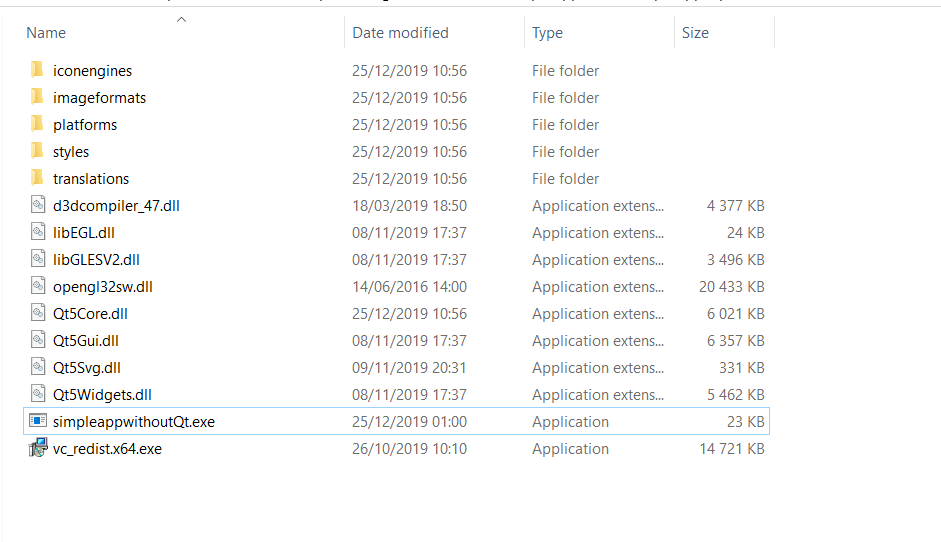
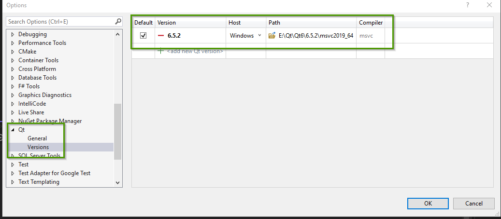
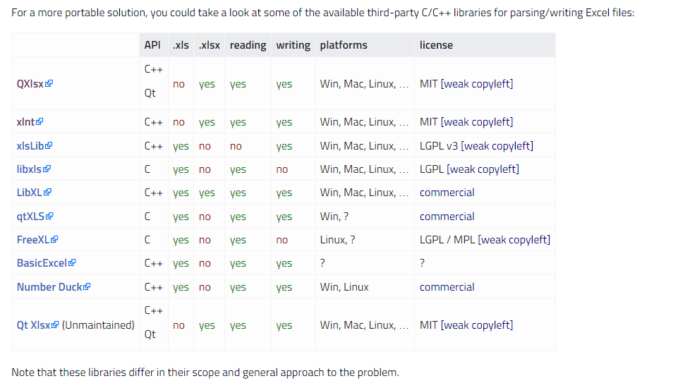

= Qt
Doc Writer <christian.popescu@outlook.com>
v 1.2, 2021-11-25
:toc:
:toclevels: 5
:sectnums:
:pdf-page-size: A3
:pdf-style:

*Qt* is a cross-platform application development framework for desktop, embedded and mobile.

With *Qt*, GUIs can be written directly in C++ using its *Widgets* module. Qt also comes with an interactive graphical tool called *Qt Designer* which functions as a code generator for Widgets based GUIs.
*Qt Designer* can be used stand-alone but is also integrated into Qt Creator.

[blue]_Qt is far more than a GUI toolkit_. It provides modules for cross-platform development in the areas of networking, databases, OpenGL, web technologies, sensors, communications protocols (Bluetooth, serial ports, NFC), XML and JSON processing, printing, PDF generation, and much more.

== Create simple application without Qt Creator

1. Create project folder

	Example: 03-SimpleAppWithouQtCreator

2. Add the following main.cpp file

[source, c++, indent=4]
----
include::src/Main.cpp[]
----
 
3.Add Qt project file SimpleApp.pro

[source, indent=4]
----
include::src/SimpleApp.pro[]
----

4.In QT command window (MSVS or MingW) call *qmake* tool. The qmake generates the make files.

*Note*: In MSVS the vcvars.bat should be run before.

image::img/01-qmake_generating_makefiles.png[]

5.In QT command windows run the make/nmake command.

6.Run the *.exe file created in release/debug folder (*from command line*).

image::img/02-simple-application.png[]

== Deploy Qt application

=== Windows

https://doc.qt.io/qt-5/windows-deployment.html#application-dependencies[Qt application Deployement for Windows] 

1. Execute nmake release. This will create the *release* folder.

2. In the release folder execute *windeployqt* windows deployement tool. 

	Example: windeployqt simpleappwithoutQt.exe

3.This creates the deployement package.

== Integrate QT with Windows

Open the Visual Studio 2022 IDE. Under tools select Extensions and Updates. click the Online arrow on the left and search for Qt. Install the Qt Visual Studio Tools extension.

Configure Visual Studio to use QT.

== Troubleshooting

Sometimes the build 64bits doesn't work.

In this case check QMAKE_SPEC variable and set it as win64-msvc

* to query

    qmake -query QMAKE_SPEC

* to set

    qmake -set QMAKE_SPEC win64-msvc

===  msvc-version.conf loaded but QMAKE_MSC_VER isn't set

The variable seems to be set by qs QMAKE_MSC_VER = _MSC_VER

Where _MSC_VER is set by MS Visual Studio

I've changed to a build MSVS and it works.

== Miscelaneous

=== Shadow build

Qt has a wonderful option: you can build Qt depending on your need from the same source code in many different flavors. This way you build different versions of Qt on your development machine from the same source code.

https://wiki.qt.io/Qt_shadow_builds[Shadow builds]

== Manipulate different file formats

=== Microsoft Excel file format

. Using Excel itself via Qt's ActiveX framework.

. Using ODBC

. Using independent parser/writer libraries

. Using manual XML processing

https://wiki.qt.io/Handling_Microsoft_Excel_file_format[]

