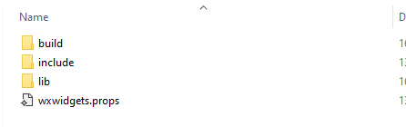
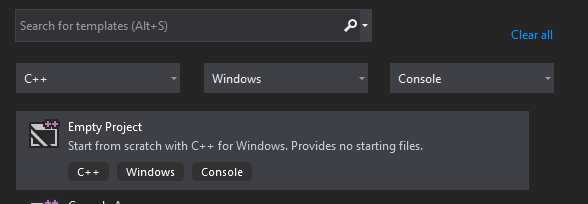
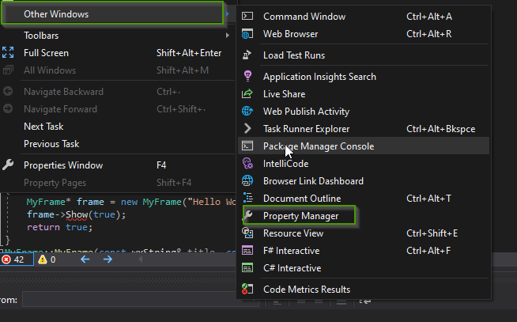
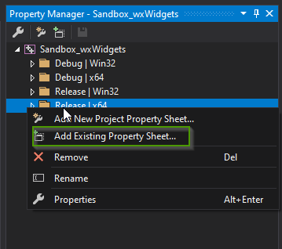
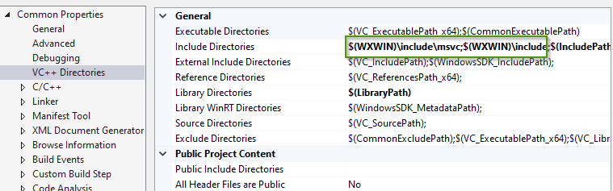
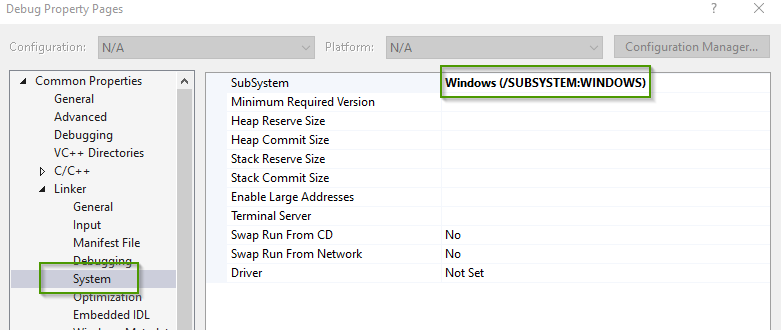
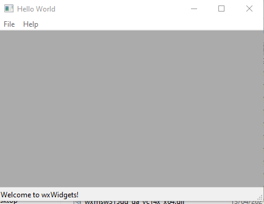
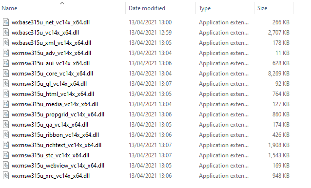
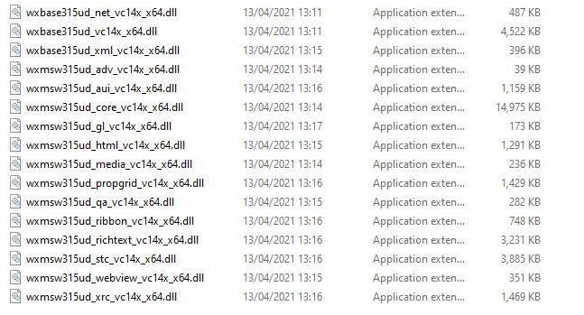

= wxWidgets library
Doc Writer <christian.popescu@outlook.com>
v 1.1, 2023-03-28
:toc:
:toclevels: 5
:sectnums:
:pdf-page-size: A3
:pdf-style:

== Introduction

As stated on the official site (see references).

*wxWidgets* is a C++ library that lets developers create applications for Windows, macOS, Linux and other platforms with a single code base.

*wxWidgets* is a programmer’s toolkit for writing desktop or mobile applications with graphical user interfaces (GUIs).

It has popular language bindings for _Python_, _Perl_, _Ruby_ and many other languages, and unlike other cross-platform toolkits, wxWidgets gives applications a truly native look and feel because it uses the platform's native API rather than emulating the GUI.

*wxWidgets* provides classes for files and streams, multiple threads, application settings, interprocess communication, online help, database access, and much more.

=== Last tested version

[cols="1,1"]
|===
|Latest Stable Release: |*3.2.2.1*

|Released: |*February 13, 2023*

|API Stable Since: |*July 7, 2022*
|===
=== References

https://www.wxwidgets.org/[Main Site]

https://docs.wxwidgets.org/trunk/index.html[Documentation]

https://wiki.wxwidgets.org/Main_Page[Wiki]

==== Books

*Cross-Platform GUI Programming with wxWidgets*

    by Julian Smart and Kevin Hock with Stefan Csomor
    Prentice Hall
    2006 Pearson Education

== Cookbook

=== Installation and Build

==== Windows + Visual Studio

I am going to test and document the installation and the build of a solution based on different documentation found on site.

I'll use the development version 3.1.5.

. Get the binaries, sources and header files.
+
If you are using one of the supported compiler, like Visual Studio C++ compiler, you can use *the prebuild binaries*.
+
https://docs.wxwidgets.org/trunk/plat_msw_binaries.html
+
The binaries are available at: https://www.wxwidgets.org/downloads#v3.1.5_msw
+
image::img/Download binaries.png[]
+
[cols="1,1"]
|===
| wxMSW-3.1.5_vc14x_x64_Dev.7z
| Development files, libs, debug DLL, *wxwidgets.props* file

| wxWidgets-3.1.5-headers.7z
| Header files

| wxMSW-3.1.5_vc14x_x64_ReleaseDLL.7z
| Release dlls

| wxMSW-3.1.5_vc14x_x64_ReleasePDB.7z
| Release PDBs

| wxWidgets-3.1.5.zip
| Archived sources

|===
+
. Unzip the header files and the lib

* Create the folder for lib and includes :

   D:\ccp_vhdd_app\wxWidgets

* Create environment variable [.blue]#*WXWIN*# that point to the lib + header folder

* Unzip wxMSW-3.1.5_vc14x_x64_Dev.7z + wxWidgets-3.1.5-headers.7z to $WXWIN folder

    The resulted structure is :
+

+
. Using wxWidges with Visual Studio
+
* Create a new empty C++ solution
+

+
* Add the following program to solution. Program get from
 https://docs.wxwidgets.org/3.0.5/overview_helloworld.html
+
[source,c++]
----
include::src/Program.cpp[indent=4]
----
+
* Set the project to use the wxWidgets files. For this include the file *wxwidgets.props* as property sheet for the project.

** Select View/Other windows
+

** For each configuration that you will use right click and select
+

+
** Add *$(WXWIN)\include\msvc;$(WXWIN)\include* to compiler folder
+

+
** Set Windows (/SUBSYSTEM:WINDOWS) for linker
+

+
. Build and run project
+
Here it is the "Hello World" application:
+

Note: To run the application needs the DLLs (release or debug).

* Release
+

Note: Release Dlls location

    wxMSW-3.2.2_vc14x_x64_ReleaseDLL.7z
    wxMSW-3.2.2_vc14x_x64_ReleasePDB.7z

* Debug
+

Note: Debug Dll location :

    wxMSW-3.2.2_vc14x_x64_Dev.7z\lib\vc14x_x64_dll\

== Programming notes

You need not to define a main/Winmain function. A system of macros generates the necessary function.

The macro wxIMPLEMENT_APP should be called only once with the derived App class for your application.

[source,c++]
----
// Use this macro exactly once, the argument is the name of the wxApp-derived
// class which is the class of your application.
#define wxIMPLEMENT_APP(appname)            \
    wxIMPLEMENT_WX_THEME_SUPPORT            \
    wxIMPLEMENT_APP_NO_THEMES(appname)
----