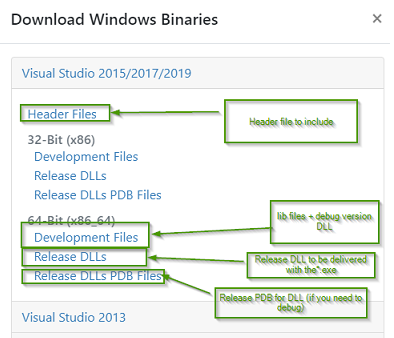

= wxWidgets
Doc Writer <christian.popescu@outlook.com>
v 1.0, 2022-01-16
:toc:
:toclevels: 5
:sectnums:
:pdf-page-size: A3
:pdf-style:

== Introduction

As stated on the official site (see references).

*wxWidgets* is a C++ library that lets developers create applications for Windows, macOS, Linux and other platforms with a single code base.

It has popular language bindings for _Python_, _Perl_, _Ruby_ and many other languages, and unlike other cross-platform toolkits, wxWidgets gives applications a truly native look and feel because it uses the platform's native API rather than emulating the GUI.

=== References

https://www.wxwidgets.org/[Main Site]

https://docs.wxwidgets.org/trunk/index.html[Documentation]

https://wiki.wxwidgets.org/Main_Page[Wiki]

== Cookbook

=== Installation and Build

==== Windows + Visual Studio

I am going to test and document the installation and the build of a solution based on different documentation found on site.

I'll use the development version 3.1.5.

If you are using one of the supported compiler, like Visual Studio C++ compiler, you can use *the prebuild binaries*.

https://docs.wxwidgets.org/trunk/plat_msw_binaries.html

The binaries are available at: https://www.wxwidgets.org/downloads#v3.1.5_msw

[cols="1,1"]
|===
| wxMSW-3.1.5_vc14x_x64_Dev.7z
| Development files

| wxWidgets-3.1.5-headers.7z
| Header files

| wxMSW-3.1.5_vc14x_x64_ReleaseDLL.7z
| Release dlls

| wxMSW-3.1.5_vc14x_x64_ReleasePDB.7z
| Release PDBs

| wxWidgets-3.1.5.zip
| Archived sources

|===
