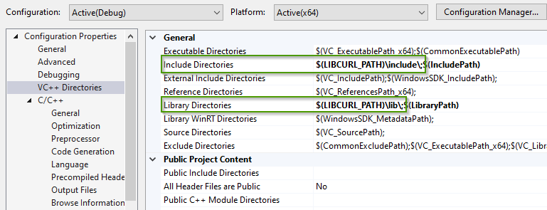
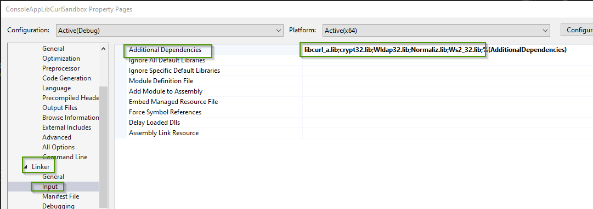

= Lib Curl
Doc Writer <christian.popescu@outlook.com>
v 1.0, 2022-05-15
:toc:
:toclevels: 5
:sectnums:
:pdf-page-size: A3
:pdf-style:

== Introduction
libcurl - the multiprotocol file transfer library

https://curl.se/libcurl/[Official curl / libcurl site]

== CookBook
=== Using LibCurl with Visual Studio

Interesting article on Stackoveflow :

https://stackoverflow.com/questions/53861300/how-do-you-properly-install-libcurl-for-use-in-visual-studio-2017[Intall properly libcurl for visual studio]

In my case I used

* libcurl_a.lib
* crypt32.lib
* Wldap32.lib
* Normaliz.lib

==== Practical installation

Version downloaded: *curl-7.83.1.zip*

Steps :

. Download version
. Unzip
. Open Visual Studio 2022 Developer Command Prompt v17.0.4
. Go to build folder D:\ccp_vhdd_app\*curl-7.83.1\winbuild*
. Create static library by running the command

    nmake /f Makefile.vc mode=static

. This will build curl as a static library into

    D:\ccp_vhdd_app\curl-7.83.1\builds\libcurl-vc-x64-release-static-ipv6-sspi-schannel

. Definie environment variable that points to the static build

    $env:LIBCURL_PATH = 'D:\ccp_vhdd_app\curl-7.83.1\builds\libcurl-vc-x64-release-static-ipv6-sspi-schannel'

. Set Visual Studio environment

.. Add libcurl in Include Directories + Library Directories
+

+
.. Add aditional libraries for the linker

    libcurl_a.lib
    crypt32.lib
    Wldap32.lib
    Normaliz.lib
    Ws2_32.lib
+

+
.. The definition CURL_STATICLIB should be added to the project. See below example of minimal source code in C++
+
[source, c++]
----
#include <iostream>
#define CURL_STATICLIB
#include <curl/curl.h>

int main()
{
    CURL* curl;
    CURLcode res;

    curl = curl_easy_init();
    if (curl) {
        curl_easy_setopt(curl, CURLOPT_URL, "https://www.google.com");
        /* Perform the request, res will get the return code */
        res = curl_easy_perform(curl);
        /* Check for errors */
        if (res != CURLE_OK)
            std::cerr << "curl_easy_perform() failed:" << curl_easy_strerror(res) << std::endl;

        /* always cleanup */
        curl_easy_cleanup(curl);
    }
}
----

== Development with C++

Libcurl with c++
There's basically only one thing to keep in mind when using C++ instead of C when interfacing libcurl:

The callbacks CANNOT be non-static class member functions

Example C++ code:

[source, c++]
----
class AClass {
static size_t write_data(void *ptr, size_t size, size_t nmemb, void *ourpointer)
    {
        /* do what you want with the data */
    }
}
----