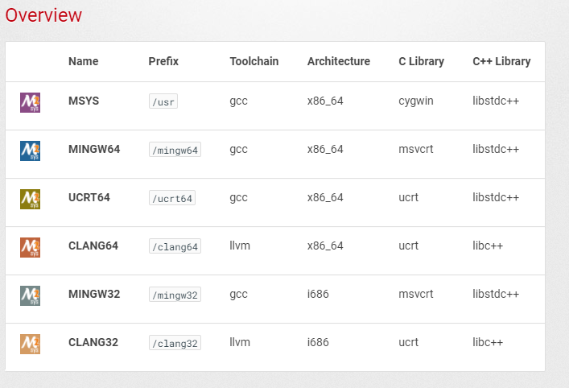

= MSYS2
Doc Writer <christian.popescu@outlook.com>
v 1.0, 2021-11-20
:sectnums:
:toc:
:toclevels: 5
:pdf-page-size: A3

== Introduction

=== About MSYS2

*MSYS2* is a collection of tools and libraries providing you with an easy-to-use environment for building, installing and running native Windows software.
MSYS2 allows you to build native Windows programs.

=== A note about msys vs mingw64 repos
Some things are only available in the msys/ repo like vim and git, and will only be available in \usr\bin\. Some things like *gcc* are available in msys\, mingw32\, and mingw64\ repos and can potentially end up being installed in both \usr\bin\ and \mingw64\bin\. This is where you have to be careful about how you set up your PATH environment variable. If you add \usr\bin\ in order to make vim or git available, you will also add everything in that directory, which may conflict with something if you also add the \mingw64\bin\ directory to your path. If you only want the toolchain without as much extra stuff, use the mingw64 packages. Then you can add only the \mingw64\bin directory to your PATH if desired. The mingw64 repository generally has more libraries available for install that are unavailable in the general msys repo (e.g. SDL, exif, freeglut). The msys packages are intended to be used inside the msys shell, and the mingw packages are intended to be used outside of msys2.

=== Resources

https://www.msys2.org/[Official site]

https://www.devdungeon.com/content/install-gcc-compiler-windows-msys2-cc[]

== Environments

https://www.msys2.org/docs/environments/[]

*MSYS2* comes with different environments/subsystems and the first thing you have to decide is which one to use. The differences among the environments are mainly environment variables, default compilers/linkers, architecture, system libraries used etc. If you are unsure, go with MINGW64.

The MSYS environment contains the unix-like/cygwin based tools, lives under /usr and are special in that it is always active. All the other environments inherit from the MSYS environment and add various things on top of it.

For example, in the MINGW64 environment the $PATH variable starts with /mingw64/bin:/usr/bin [BLUE]#*so you get all mingw64 based tools as well as all msys tools*# .

