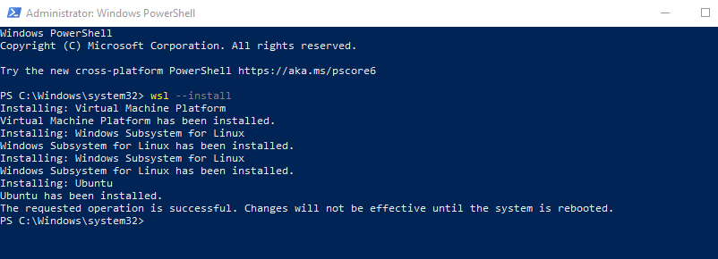

= WSL - The Windows Subsystem for Linux
Doc Writer <christian.popescu@outlook.com>
v 1.0, 2023-01-27
:sectnums:
:toc:
:toclevels: 5
:pdf-page-size: A3

== Introduction

link:https://docs.microsoft.com/en-us/windows/wsl/install[Doc on Microsoft site]

Developers can access the power of both Windows and Linux at the same time on a Windows machine.
The Windows Subsystem for Linux (WSL) lets developers install a Linux distribution (such as Ubuntu, OpenSUSE, Kali, Debian, Arch Linux, etc) and use Linux applications, utilities, and Bash command-line tools directly on Windows, unmodified, without the overhead of a traditional virtual machine or dual boot setup.

== Installation

Run Powershell in admin mode.

    wsl --install

