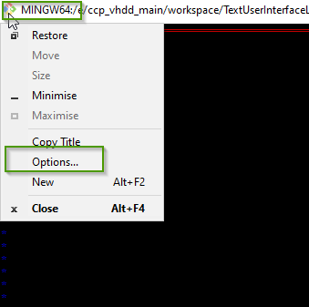
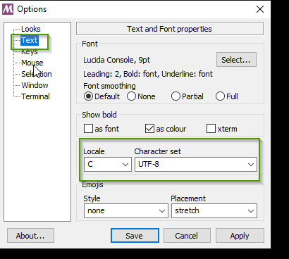

= Miscellaneous
Doc Writer <christian.popescu@outlook.com>
v 1.0, 2019-12-22
:sectnums:
:toc:
:toclevels: 5

== Introduction
It's about diferents subjects to organize latter

== SYS2 + build GCC

*MSYS2* is a software distro and building platform for Windows.

At its core is an independent rewrite of MSYS, based on modern Cygwin (POSIX compatibility layer) and MinGW-w64 with the aim of better interoperability with native Windows software. 
It provides a bash shell, Autotools, revision control systems and the like for building native Windows applications using MinGW-w64 toolchains.

Site: https://www.msys2.org/[Home page of msys2 org] 

=== Simplified installation procedure

1. Download and run the installer - "x86_64" for 64-bit, "i686" for 32-bit Windows.
 
2. Update the package database and core system packages with:
	
	pacman -Syu
 
 
 3. close MSYS2 (close window not exit or quit), run it again from Start menu. Syncrhonize the rest.
 
 	pacman -Su
 	
 4. Add different tools
 
	 pacman -S --needed base-devel perl ruby python2 wget p7zip
 
 The default location of gem installs is $HOME/.gem/ruby
Add the following line to your PATH if you plan to install using gem
$(ruby -rubygems -e "puts Gem.user_dir")/bin
If you want to install to the system wide location, you must either:
edit /etc/gemrc or run gem with the --no-user-install flag.
Optional dependencies for ruby
    ruby-docs: Ruby documentation
 
 
 
5. Add control sources tools.

	 pacman -S --needed git subversion
	 
6. Add gcc toolchaing

	pacman -S mingw-w64-i686-toolchain mingw-w64-x86_64-toolchain 

7. Add Cmake

	pacman -S mingw-w64-i686-cmake mingw-w64-x86_64-cmake 
    
    
== Unicode issue on Git Bash Window

=== Context
Java Text User Interface Application that use UTF8 codes for graphical driving (boxes).

=== The problem
Problem solved on Windows. When the same program runs on Git Bash strage characters has been printed.

=== Solution 
On MingW window set the Locale as default and charset as UTF8.

=== Get path environment variable one entry by line

==== Context
Usually the path variable Windows or Linux is shown as one line.

====  The problem
This is not very practical if we search something in particular

=== Solution

Open terminal session (Ming Bash on Windows). Use the following command

    echo $PATH | sed 's/:/\n/g'

Sample oputut:

image::/img/PathOneEntryByLine.png[]

