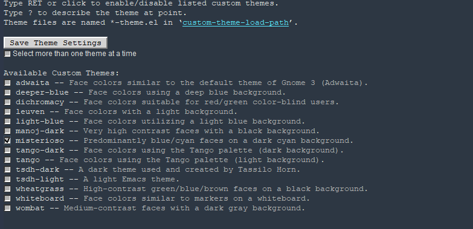

== Emacs
Doc Writer <christian.popescu@outlook.com>
v 1.0, 2021-11-28
:toc:

*Emacs* is an extensible, customizable, free/libre text editor -- and more.

https://www.gnu.org/software/emacs/[Project site]

=== Emacs cheatsheet

1.Editing

* Cut   - C+w
* Copy  - M+w
* Paste - C+y

=== Change theme

M-x customize-themes -> to switch to a buffer named \*Custom Themes*

