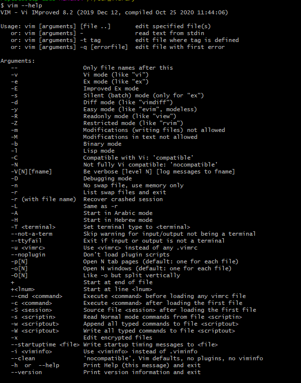

= Vim
Doc Writer <christian.popescu@outlook.com>
v 1.1, 2021-11-27
:toc:
:toclevels: 5
:sectnums:

== Introduction

*Vim* is a highly configurable text editor for efficiently creating and changing any kind of text. It is included as "vi" with most UNIX systems and with Apple OS X..

https://www.vim.org/[Vim site]

== Commands cheat sheet

=== Help info

