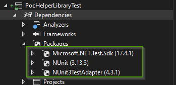
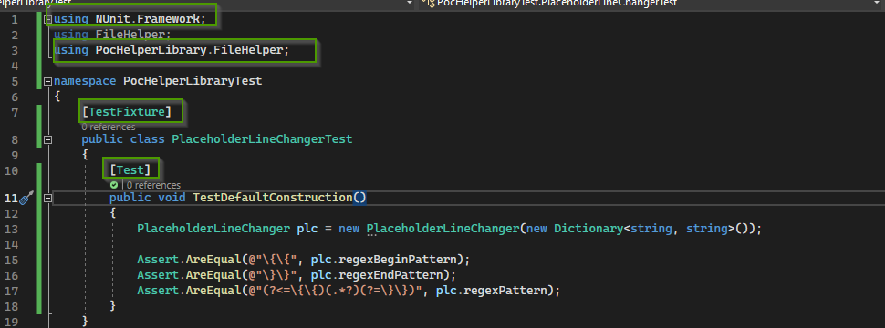

= C# Unit Tests
Doc Writer <christian.popescu@outlook.com>
v 1.1, 2023-01-21
:sectnums:
:toc:
:toclevels: 5

link:../../../content/KnowledManagementRoot.adoc [Home]

= Introduction

It's about the main unit test framework used for C#

https://learn.microsoft.com/en-us/dotnet/core/testing/[Testing on Microsoft Site]

= Frameworks

== xUnit
*xUnit* is a free, open-source, community-focused unit testing tool for .NET. The original inventor of NUnit v2 wrote xUnit.net. xUnit.net is the latest technology for unit testing .NET apps. It also works with ReSharper, CodeRush, TestDriven.NET, and Xamarin. xUnit.net is a project of the .NET Foundation and operates under its code of conduct.

== NUnit

*NUnit* is a unit-testing framework for all .NET languages. Initially, NUnit was ported from JUnit, and the current production release has been rewritten with many new features and support for a wide range of .NET platforms. It's a project of the .NET Foundation.

== MS Test

MSTest is the Microsoft test framework for all .NET languages. It's extensible and works with both .NET CLI and Visual Studio

= Unit tests - How to

== NUnit

https://learn.microsoft.com/en-us/dotnet/core/testing/unit-testing-with-nunit[Unit Testing with NUnit on Microsoft Site]

https://docs.nunit.org/articles/nunit/intro.html[NUnit Documentation]

*Visual Studio Test Adapter*

The NUnit 3 Test Adapter allows you to run NUnit 3 tests inside Visual Studio or with dotnet on the command line.

=== Set Up Test for .net (core) framework

* Create a test library.

* NUnit framework

    install-Package NUnit -Version 3.13.3
[source]
----
Install from package manager console (visual studio)
PM> Install-Package NUnit -Version 3.13.3
Restoring packages for D:\ccp_wrks\Poc\10-PocNetFrameworkHelperLibrary\src\PocHelperLibrary\PocHelperLibraryTest\PocHelperLibraryTest.csproj...
GET https://api.nuget.org/v3-flatcontainer/nunit/index.json
OK https://api.nuget.org/v3-flatcontainer/nunit/index.json 122ms
GET https://api.nuget.org/v3-flatcontainer/nunit/3.13.3/nunit.3.13.3.nupkg
OK https://api.nuget.org/v3-flatcontainer/nunit/3.13.3/nunit.3.13.3.nupkg 8ms
Installed Microsoft.NETCore.Platforms 1.1.0 from C:\Program Files (x86)\Microsoft SDKs\NuGetPackages\ with content hash kz0PEW2lhqygehI/d6XsPCQzD7ff7gUJaVGPVETX611eadGsA3A877GdSlU0LRVMCTH/+P3o2iDTak+S08V2+A==.
Installed NUnit 3.13.3 from https://api.nuget.org/v3/index.json with content hash KNPDpls6EfHwC3+nnA67fh5wpxeLb3VLFAfLxrug6JMYDLHH6InaQIWR7Sc3y75d/9IKzMksH/gi08W7XWbmnQ==.
Installed NETStandard.Library 2.0.0 from C:\Program Files (x86)\Microsoft SDKs\NuGetPackages\ with content hash 7jnbRU+L08FXKMxqUflxEXtVymWvNOrS8yHgu9s6EM8Anr6T/wIX4nZ08j/u3Asz+tCufp3YVwFSEvFTPYmBPA==.
Installing NuGet package NUnit 3.13.3.
Generating MSBuild file D:\ccp_wrks\Poc\10-PocNetFrameworkHelperLibrary\src\PocHelperLibrary\PocHelperLibraryTest\obj\PocHelperLibraryTest.csproj.nuget.g.props.
Generating MSBuild file D:\ccp_wrks\Poc\10-PocNetFrameworkHelperLibrary\src\PocHelperLibrary\PocHelperLibraryTest\obj\PocHelperLibraryTest.csproj.nuget.g.targets.
Writing assets file to disk. Path: D:\ccp_wrks\Poc\10-PocNetFrameworkHelperLibrary\src\PocHelperLibrary\PocHelperLibraryTest\obj\project.assets.json
Restored D:\ccp_wrks\Poc\10-PocNetFrameworkHelperLibrary\src\PocHelperLibrary\PocHelperLibraryTest\PocHelperLibraryTest.csproj (in 3.9 sec).
Successfully installed 'Microsoft.NETCore.Platforms 1.1.0' to PocHelperLibraryTest
Successfully installed 'NETStandard.Library 2.0.0' to PocHelperLibraryTest
Successfully installed 'NUnit 3.13.3' to PocHelperLibraryTest
Executing nuget actions took 297 ms
Time Elapsed: 00:00:04.5083532
----

* NUnit Test Adapter

Install-Package NUnit3TestAdapter -Version 4.3.1

[source]
----
PM> Install-Package NUnit3TestAdapter -Version 4.3.1
Restoring packages for D:\ccp_wrks\Poc\10-PocNetFrameworkHelperLibrary\src\PocHelperLibrary\PocHelperLibraryTest\PocHelperLibraryTest.csproj...
GET https://api.nuget.org/v3-flatcontainer/nunit3testadapter/index.json
OK https://api.nuget.org/v3-flatcontainer/nunit3testadapter/index.json 157ms
GET https://api.nuget.org/v3-flatcontainer/nunit3testadapter/4.3.1/nunit3testadapter.4.3.1.nupkg
OK https://api.nuget.org/v3-flatcontainer/nunit3testadapter/4.3.1/nunit3testadapter.4.3.1.nupkg 9ms
Installed NUnit3TestAdapter 4.3.1 from https://api.nuget.org/v3/index.json with content hash R+bGFtsUpLWywjT1nb3xMmoVa2AIw6ClIGC+XjW9lYE8hwJeos+NdR/mtg4RXbBphmC9epALrnUc6MM7mUG8+Q==.
Installing NuGet package NUnit3TestAdapter 4.3.1.
Generating MSBuild file D:\ccp_wrks\Poc\10-PocNetFrameworkHelperLibrary\src\PocHelperLibrary\PocHelperLibraryTest\obj\PocHelperLibraryTest.csproj.nuget.g.props.
Writing assets file to disk. Path: D:\ccp_wrks\Poc\10-PocNetFrameworkHelperLibrary\src\PocHelperLibrary\PocHelperLibraryTest\obj\project.assets.json
Restored D:\ccp_wrks\Poc\10-PocNetFrameworkHelperLibrary\src\PocHelperLibrary\PocHelperLibraryTest\PocHelperLibraryTest.csproj (in 376 ms).
Successfully installed 'NUnit3TestAdapter 4.3.1' to PocHelperLibraryTest
Executing nuget actions took 146 ms
Time Elapsed: 00:00:00.5394086
----

* NUnit Test SDK

Install-Package Microsoft.NET.Test.Sdk

[source]
----
PM>
Restoring packages for D:\ccp_wrks\Poc\10-PocNetFrameworkHelperLibrary\src\PocHelperLibrary\PocHelperLibraryTest\PocHelperLibraryTest.csproj...
  GET https://api.nuget.org/v3-flatcontainer/microsoft.net.test.sdk/index.json
  OK https://api.nuget.org/v3-flatcontainer/microsoft.net.test.sdk/index.json 135ms
  GET https://api.nuget.org/v3-flatcontainer/microsoft.net.test.sdk/17.4.1/microsoft.net.test.sdk.17.4.1.nupkg
  OK https://api.nuget.org/v3-flatcontainer/microsoft.net.test.sdk/17.4.1/microsoft.net.test.sdk.17.4.1.nupkg 7ms
  GET https://api.nuget.org/v3-flatcontainer/microsoft.testplatform.testhost/index.json
  GET https://api.nuget.org/v3-flatcontainer/microsoft.codecoverage/index.json
  OK https://api.nuget.org/v3-flatcontainer/microsoft.testplatform.testhost/index.json 122ms
  GET https://api.nuget.org/v3-flatcontainer/microsoft.testplatform.testhost/17.4.1/microsoft.testplatform.testhost.17.4.1.nupkg
  OK https://api.nuget.org/v3-flatcontainer/microsoft.testplatform.testhost/17.4.1/microsoft.testplatform.testhost.17.4.1.nupkg 8ms
  OK https://api.nuget.org/v3-flatcontainer/microsoft.codecoverage/index.json 146ms
  GET https://api.nuget.org/v3-flatcontainer/microsoft.codecoverage/17.4.1/microsoft.codecoverage.17.4.1.nupkg
  OK https://api.nuget.org/v3-flatcontainer/microsoft.codecoverage/17.4.1/microsoft.codecoverage.17.4.1.nupkg 8ms
  GET https://api.nuget.org/v3-flatcontainer/microsoft.testplatform.objectmodel/index.json
  GET https://api.nuget.org/v3-flatcontainer/newtonsoft.json/index.json
  OK https://api.nuget.org/v3-flatcontainer/microsoft.testplatform.objectmodel/index.json 119ms
  GET https://api.nuget.org/v3-flatcontainer/microsoft.testplatform.objectmodel/17.4.1/microsoft.testplatform.objectmodel.17.4.1.nupkg
  OK https://api.nuget.org/v3-flatcontainer/microsoft.testplatform.objectmodel/17.4.1/microsoft.testplatform.objectmodel.17.4.1.nupkg 7ms
  OK https://api.nuget.org/v3-flatcontainer/newtonsoft.json/index.json 141ms
  GET https://api.nuget.org/v3-flatcontainer/newtonsoft.json/13.0.1/newtonsoft.json.13.0.1.nupkg
  OK https://api.nuget.org/v3-flatcontainer/newtonsoft.json/13.0.1/newtonsoft.json.13.0.1.nupkg 8ms
  GET https://api.nuget.org/v3-flatcontainer/nuget.frameworks/index.json
  OK https://api.nuget.org/v3-flatcontainer/nuget.frameworks/index.json 122ms
  GET https://api.nuget.org/v3-flatcontainer/nuget.frameworks/5.11.0/nuget.frameworks.5.11.0.nupkg
  OK https://api.nuget.org/v3-flatcontainer/nuget.frameworks/5.11.0/nuget.frameworks.5.11.0.nupkg 8ms
Installed Microsoft.NET.Test.Sdk 17.4.1 from https://api.nuget.org/v3/index.json with content hash kJ5/v2ad+VEg1fL8UH18nD71Eu+Fq6dM4RKBVqlV2MLSEK/AW4LUkqlk7m7G+BrxEDJVwPjxHam17nldxV80Ow==.
Installed NuGet.Frameworks 5.11.0 from https://api.nuget.org/v3/index.json with content hash eaiXkUjC4NPcquGWzAGMXjuxvLwc6XGKMptSyOGQeT0X70BUZObuybJFZLA0OfTdueLd3US23NBPTBb6iF3V1Q==.
Installed System.Reflection.Metadata 1.6.0 from C:\Program Files (x86)\Microsoft SDKs\NuGetPackages\ with content hash COC1aiAJjCoA5GBF+QKL2uLqEBew4JsCkQmoHKbN3TlOZKa2fKLz5CpiRQKDz0RsAOEGsVKqOD5bomsXq/4STQ==.
Installed Newtonsoft.Json 13.0.1 from https://api.nuget.org/v3/index.json with content hash ppPFpBcvxdsfUonNcvITKqLl3bqxWbDCZIzDWHzjpdAHRFfZe0Dw9HmA0+za13IdyrgJwpkDTDA9fHaxOrt20A==.
Installed Microsoft.TestPlatform.TestHost 17.4.1 from https://api.nuget.org/v3/index.json with content hash K7QXM4P4qrDKdPs/VSEKXR08QEru7daAK8vlIbhwENM3peXJwb9QgrAbtbYyyfVnX+F1m+1hntTH6aRX+h/f8g==.
Installed Microsoft.TestPlatform.ObjectModel 17.4.1 from https://api.nuget.org/v3/index.json with content hash v2CwoejusooZa/DZYt7UXo+CJOvwAmqg6ZyFJeIBu+DCRDqpEtf7WYhZ/AWii0EKzANPPLU9+m148aipYQkTuA==.
Installed Microsoft.CodeCoverage 17.4.1 from https://api.nuget.org/v3/index.json with content hash T21KxaiFawbrrjm0uXjxAStXaBm5P9H6Nnf8BUtBTvIpd8q57lrChVBCY2dnazmSu9/kuX4z5+kAOT78Dod7vA==.
Installing NuGet package Microsoft.NET.Test.Sdk 17.4.1.
Generating MSBuild file D:\ccp_wrks\Poc\10-PocNetFrameworkHelperLibrary\src\PocHelperLibrary\PocHelperLibraryTest\obj\PocHelperLibraryTest.csproj.nuget.g.props.
Generating MSBuild file D:\ccp_wrks\Poc\10-PocNetFrameworkHelperLibrary\src\PocHelperLibrary\PocHelperLibraryTest\obj\PocHelperLibraryTest.csproj.nuget.g.targets.
Writing assets file to disk. Path: D:\ccp_wrks\Poc\10-PocNetFrameworkHelperLibrary\src\PocHelperLibrary\PocHelperLibraryTest\obj\project.assets.json
Restored D:\ccp_wrks\Poc\10-PocNetFrameworkHelperLibrary\src\PocHelperLibrary\PocHelperLibraryTest\PocHelperLibraryTest.csproj (in 1.86 sec).
Successfully installed 'Microsoft.CodeCoverage 17.4.1' to PocHelperLibraryTest
Successfully installed 'Microsoft.NET.Test.Sdk 17.4.1' to PocHelperLibraryTest
Successfully installed 'Microsoft.TestPlatform.ObjectModel 17.4.1' to PocHelperLibraryTest
Successfully installed 'Microsoft.TestPlatform.TestHost 17.4.1' to PocHelperLibraryTest
Successfully installed 'Newtonsoft.Json 13.0.1' to PocHelperLibraryTest
Successfully installed 'NuGet.Frameworks 5.11.0' to PocHelperLibraryTest
Successfully installed 'System.Reflection.Metadata 1.6.0' to PocHelperLibraryTest
Executing nuget actions took 114 ms
Time Elapsed: 00:00:02.6533052
----

Sample image on references:

* Add reference from the library to test to the test libary

* Add [TestFixture] attribute to class that contains tests

* Add [Test] attribute to the methods that define tests

